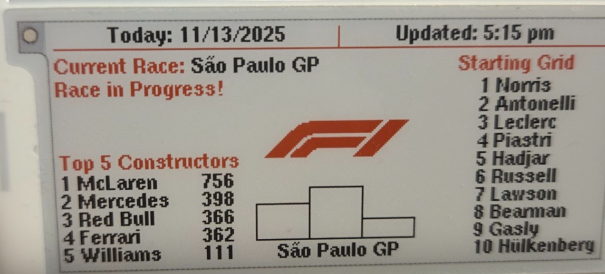

# F1 Tracker - 3 Color E-Paper Display with Enhanced Features

This is an enhanced version of https://github.com/mazur888/F1-Info-display. Including new features, caching and adjustable updates. Designed specifically for a ESP32-C3 Supermini and a 3-color e-paper display. Shows race calendar, driver standings, constructor standings, starting grids, and race results with intelligent update scheduling based on race timing.

<p align="center">
<a href="https://www.buymeacoffee.com/wnt2fly" target="_blank"></a>
</p>
  

  

## Features

- 📅 **Race Calendar** - Shows next and last race information
- 🏁 **Starting Grid** - Displays qualifying positions when available (within 18h of race)
- 🏆 **Driver Standings** - Top 10 drivers with points
- 🏎️ **Constructor Standings** - Top 5 constructors with points
- 🥇 **Race Results** - Podium finishers from last race
- ⏱️ **Countdown Timer** - Time until next race with local timezone support
- 🔄 **Smart Updates** - Update frequency adapts based on proximity to race events
- 💾 **Intelligent Caching** - Reduces API calls with multi-level caching
- 🌐 **WiFi Manager** - Easy WiFi setup via captive portal

## Hardware Requirements

### Required Components
- **ESP32-C3 Mini** (or compatible ESP32-C3 board)
- **3-Color E-Paper Display** - GxEPD2_290_C90c (296x128 pixels)
- **SPI Connections** - For display communication
- **Power Supply** - 3.3V/5V depending on your setup

### Pin Connections

| Display Pin | ESP32-C3 Pin | Function |
|------------|-------------|----------|
| BUSY       | GPIO 4      | Busy signal |
| RST        | GPIO 5      | Reset |
| DC         | GPIO 7      | Data/Command |
| CS         | GPIO 3      | Chip Select |
| SCK        | GPIO 6      | SPI Clock |
| MOSI       | GPIO 10     | SPI Data |

## Installation

### 1. Arduino IDE Setup

1. Install **Arduino IDE** (1.8.x or 2.x)
2. Add ESP32 board support:
   - File → Preferences → Additional Boards Manager URLs
   - Add: `https://raw.githubusercontent.com/espressif/arduino-esp32/gh-pages/package_esp32_index.json`
   - Tools → Board → Boards Manager → Search "ESP32" → Install

### 2. Install Required Libraries

Install the following libraries via Library Manager (Sketch → Include Library → Manage Libraries):

- **ArduinoJson** (v7.x) - JSON parsing
- **GxEPD2** - E-paper display driver
- **U8g2_for_Adafruit_GFX** - Font rendering
- **WiFiManager** - WiFi configuration
- **Preferences** - Built-in ESP32 library

### 3. Board Configuration

**Tools → Board:** Select your ESP32-C3 board (e.g., "ESP32C3 Dev Module")

**Tools → Partition Scheme:** Select **"Huge APP (3MB No OTA)"** or **"No OTA (3MB)"**
- This gives you 3MB for your application (vs 1.4MB with OTA partition)

**Other Settings:**
- **Flash Size:** 4MB (if available)
- **CPU Frequency:** 160MHz (or 80MHz for lower power)
- **Upload Speed:** 921600 (or lower if you have issues)

### 4. Upload Code

1. Open `F1_Tracker_3Color.ino` in Arduino IDE
2. Connect ESP32-C3 via USB
3. Select correct COM port (Tools → Port)
4. Click Upload

## First Time Setup

### WiFi Configuration

On first boot, the device will create a WiFi access point:

1. **SSID:** `F1Tracker-Setup`
2. **Password:** `formula1`
3. Connect to this network from your phone/computer
4. A captive portal should open automatically (or navigate to `192.168.4.1`)
5. Select your home WiFi network and enter password
6. The device will save credentials and connect

The display will show setup instructions during this process.


### Display Modes

The display automatically switches between 4 modes based on race timing:

**Mode 1: Normal Operation** (>18 hours before race):
- Shows driver standings (top 10)
- Shows constructor standings (top 5)
- Shows last race podium (if results available)
- Shows next race countdown

**Mode 2: Race Approaching** (within 18h before race, grid available):
- Switches to starting grid (qualifying positions)
- Shows constructor standings (top 5)
- Hides old podium, shows "Awaiting Results"
- Shows next race info with "Awaiting Results" message

**Mode 3: Race In Progress** (race started, results not available yet):
- Shows "Current Race: [Name]"
- Shows "Race in Progress!"
- Shows starting grid (continues during race)
- Shows empty podium (no names, just boxes)

**Mode 4: Post-Race** (results available):
- Shows driver standings (switched from grid)
- Shows constructor standings (top 5)
- Shows last race podium with winner names
- Shows next race information



## Update Schedule

The display automatically adjusts update frequency based on race timing:

| Time Before Race | Update Frequency | Reason |
|------------------|------------------|--------|
| **>48 hours** | Every 6 hours | Nothing changes, minimal updates |
| **24-48 hours** | Every 2 hours | Grid might be posted |
| **<24 hours** | Every 30 minutes | Actively searching for starting grid |
| **Grid Found** | Every 2 hours | Grid found, back to normal until race |
| **Race Window** (6h before to 6h after) | Every 30 minutes | Frequent updates during race event |
| **After Race** | Every 2 hours | Normal operation |

**Update Times:**
- 6-hour updates: 12:00 AM, 6:00 AM, 12:00 PM, 6:00 PM
- 2-hour updates: Even hours at :00 (12:00 AM, 2:00 AM, 4:00 AM, etc.)
- 30-minute updates: :00 and :30 of every hour

## API Information

### Data Source
- **API:** Ergast F1 API (via jolpi.ca proxy)
- **Base URL:** `https://api.jolpi.ca/ergast/f1/{year}/`
- **Endpoints Used:**
  - `/races.json` - Race calendar
  - `/driverstandings.json` - Driver championship
  - `/constructorstandings.json` - Constructor championship
  - `/{round}/qualifying.json` - Starting grid
  - `/{round}/results.json` - Race results

### Caching Strategy

The code uses intelligent multi-level caching:

- **Calendar Cache:** 1 hour TTL
- **Standings Cache:** 1 hour TTL (invalidated when race finishes)
- **Qualifying Cache:** 24 hours TTL (never changes once posted)
- **Results Cache:** 1 hour TTL
- **Availability Cache:** 
  - Qualifying: 12 hours (never changes once posted)
  - Results: 5 minutes (can appear after race)

This reduces API calls by ~99% compared to no caching.

## Configuration

### Timezone

Default timezone is set to **EST/EDT** (Eastern Time). To change:

Edit line 147 in `F1_Tracker_3Color.ino`:
```cpp
#define MY_TZ "EST5EDT,M3.2.0/2,M11.1.0/2"
```

For other timezones, use TZ format:
- PST: `"PST8PDT,M3.2.0/2,M11.1.0/2"`
- GMT: `"GMT0"`
- See [TZ database](https://en.wikipedia.org/wiki/List_of_tz_database_time_zones) for full list

### Update Intervals

Update frequencies can be adjusted in the code (lines 32-35):

```cpp
const int UPDATE_INTERVAL_FAR_MIN = 360;        // >48h: 6 hours
const int UPDATE_INTERVAL_NORMAL_MIN = 120;     // Normal: 2 hours
const int UPDATE_INTERVAL_RACE_WINDOW_MIN = 30; // Race window: 30 min
const int UPDATE_INTERVAL_GRID_SEARCH_MIN = 30; // Grid search: 30 min
```

### Debug Mode

Debug mode allows you to test all display modes without waiting for actual race events. It simulates different times relative to a past race, allowing you to cycle through all scenarios interactively.

#### Enabling Debug Mode

1. Open `F1-Info-display-Enhanced.ino` in Arduino IDE
2. Find line 42: `#define DEBUG_MODE 0`
3. Change to: `#define DEBUG_MODE 1`
4. Upload the code

#### Using Debug Mode

1. **Open Serial Monitor** (115200 baud)
2. **Wait for initial setup** - Let the device connect to WiFi and fetch calendar data
3. **Use interactive commands** to test different scenarios

#### Interactive Menu

When debug mode starts, an interactive menu is displayed. You can use either **numbers (1-8)** or **full commands**:

**Menu Options:**
- `1` or `normal` - Jump to 3 days before race (Mode 1: Normal Operation)
- `2` or `before` - Jump to 2 hours before race (Mode 2: Race Approaching)
- `3` or `during` - Jump to race start time (Mode 3: Race In Progress)
- `4` or `after` - Jump to 5 hours after race start (Mode 4: Post-Race)
- `5` or `refresh` - Force immediate display update
- `6` or `status` - Show current offset, real time, simulated time, and race state
- `7` or `reset` - Reset to default offset (-30 days)
- `8` or `autorefresh` - Toggle auto-refresh on/off (default: OFF in debug mode)

**Time Adjustments** (also available):
- `+1h`, `+2h`, `+6h` - Add hours to time offset
- `-1h`, `-2h`, `-6h` - Subtract hours from time offset
- `+1d`, `+2d`, `+7d` - Add days to time offset
- `-1d`, `-2d`, `-7d` - Subtract days from time offset
- `set <seconds>` - Set exact time offset (e.g., `set -2592000`)

**Menu Commands:**
- `menu` or `help` or `?` - Show menu again

#### Example Workflow

```
1. Upload code with DEBUG_MODE = 1
2. Open Serial Monitor (115200 baud)
3. Wait for calendar fetch
4. Type "status" - see current state
5. Type "normal" - see Mode 1 (driver standings, countdown)
6. Type "before" - see Mode 2 (starting grid, awaiting results)
7. Type "during" - see Mode 3 (race in progress, empty podium)
8. Type "after" - see Mode 4 (post-race, results if available)
```

#### Important Notes

- **Commands are case-insensitive** (e.g., `STATUS` = `status`)
- **Serial Monitor settings:** 115200 baud, "Newline" or "Both NL & CR" line ending
- **Display refresh takes 15-30 seconds** - this is normal for e-paper displays
- **Menu reappears after commands** - After each mode command (1-4) or refresh (5) completes, the menu is shown again
- **Auto-refresh disabled by default** - Display only updates when you select a menu option (1-5)
- **WiFi stays connected** - In debug mode, WiFi remains connected for faster testing
- **Jump commands auto-refresh** - Options 1-4 automatically update the display after jumping to that time
- **Time adjustments don't refresh** - Use `+1h`, `-2h`, etc. then type `5` or `refresh` to update display
- **API calls use real time** - Debug mode only affects time calculations, not API data

#### Debug Mode Display Indicator

When debug mode is enabled, the display shows `[DEBUG] Mode X` in the header (where X is 1-4) instead of `Today:` to indicate you're in test mode and show the current display mode.

## Power Consumption

- **During Update:** ~50-100mA (display refresh takes ~15-30 seconds)
- **Hibernating:** ~10-20µA (display in deep sleep)
- **Average:** Very low due to hibernation between updates
- **Battery Life:** Weeks to months depending on update frequency and battery capacity

## Troubleshooting

### Display Not Updating

1. **Check WiFi Connection**
   - Serial monitor will show connection status
   - Device restarts if WiFi disconnects

2. **Check Time Sync**
   - Device needs NTP time sync to work
   - Serial monitor shows time sync status
   - Ensure internet connection is working

3. **Check API Access**
   - Serial monitor shows API call status
   - Verify API endpoint is accessible

### Display Shows Garbage/Corruption

1. **Power Supply**
   - Ensure stable 3.3V/5V power
   - Display needs adequate current during refresh

2. **SPI Connections**
   - Verify all pins connected correctly
   - Check for loose connections

3. **Full Refresh**
   - Display uses full refresh (not partial)
   - This is normal for 3-color displays

### WiFi Setup Issues

1. **Can't Connect to Setup AP**
   - SSID: `F1Tracker-Setup`
   - Password: `formula1`
   - Some devices may not auto-open portal - navigate to `192.168.4.1`

2. **WiFi Credentials Not Saving**
   - Check Preferences library is working
   - Device should remember credentials after first setup

### Compilation Errors

1. **"Board not found"**
   - Install ESP32 board support (see Installation)

2. **"Library not found"**
   - Install required libraries (see Installation)

3. **"Partition too small"**
   - Select "Huge APP (3MB No OTA)" partition scheme

## Technical Details

### Memory Usage

- **Flash:** ~450KB (code + libraries)
- **RAM:** ~40-70KB (with 400KB available on ESP32-C3)
- **JSON Buffer:** 12KB (optimized from 16KB)

### Display Specifications

- **Model:** GxEPD2_290_C90c
- **Resolution:** 296x128 pixels
- **Colors:** Black, White, Red (3-color)
- **Refresh Time:** ~15-30 seconds (full refresh)
- **Rotation:** 270° (landscape mode)

### Code Structure

- **Main Loop:** Checks time every 60 seconds, triggers updates on schedule
- **Update Function:** Fetches data, draws to display, hibernates
- **Caching:** Multi-level cache reduces API calls
- **Error Handling:** Graceful degradation on API failures
- **Debug Mode:** Interactive time simulation for testing all display modes

## License

This project is open source. Feel free to modify and use as needed.

## Credits

- **F1 Data:** Ergast F1 API (via jolpi.ca)
- **Display Library:** GxEPD2 by ZinggJM
- **Font Rendering:** U8g2
- **WiFi Management:** WiFiManager by tzapu

## Support

For issues or questions:
1. Check Serial Monitor output for debug information
2. Verify all connections and power supply
3. Ensure WiFi and internet connectivity
4. Check API endpoint accessibility

---

**Enjoy your F1 Tracker! 🏎️🏁**

